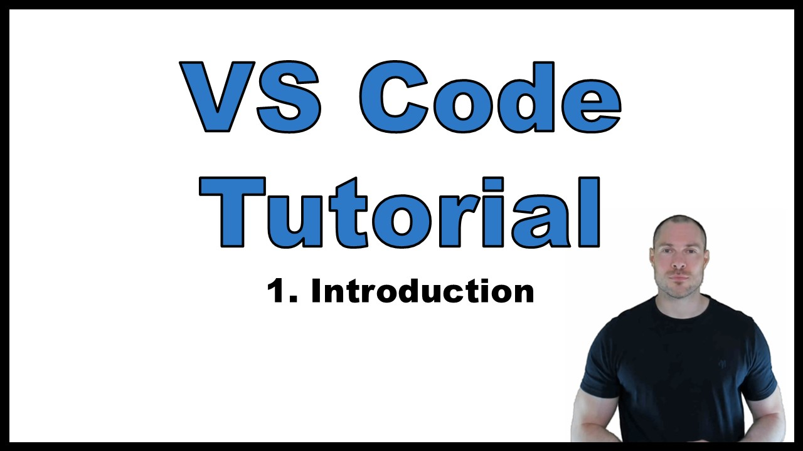

# VS Code Tutorial

This Repo contains the notes and accompanying materials for this VS Code tutorial on YouTube:

# Additional Information
- To fully make use of the notes, clone or download the following repositories and place them inside the `demonstration_examples/source_control/` folder:
    - [initial_repo]()
    - [diff_editor]()
    - [graph_view]()
- In [this video](https://youtu.be/yZfGN_78UYo) I explain how I have structured my notes.

